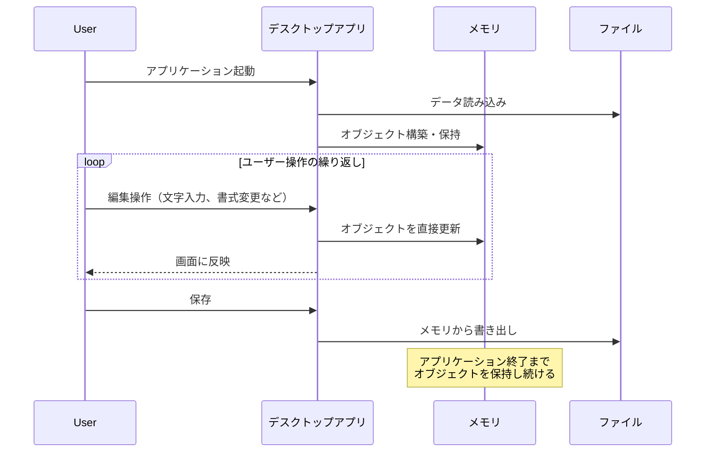
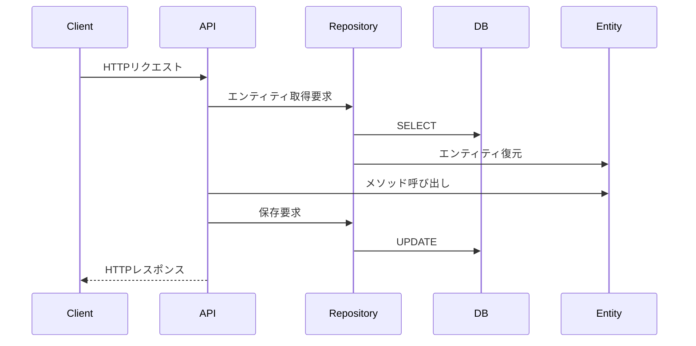

# DDDとWebバックエンドの相性

## 🟦 はじめに

私はIT技術者として、長年Webバックエンドの開発に携わってきました。
その中で、ドメイン駆動設計（DDD）の戦術的パターンとRDBを含むWebバックエンドの組み合わせに違和感を感じています。

DDDには「戦略的設計」と「戦術的パターン」があります。
戦略的設計はドメイン知識をコードに落とし込むという大きな方向性で、戦術的パターンはそれを実現するための具体的な実装手法です。

本記事では、なぜ戦術的パターン（エンティティ、集約、リポジトリなど）とWebバックエンドの相性が悪いのか、実務での経験を踏まえて説明します。

なお、ドメイン知識をコードに落とし込むという戦略的設計の思想自体は素晴らしいものです。
ここで問題にしているのは、その実装方法についてです。

## 🟦 ソフトウェアの形態とDDDの相性

DDDが提唱された2003年（Eric Evansの著書発行年）当時、エンティティパターンが最も自然に機能する環境の典型例として、Microsoft OfficeやPhotoshopのようなスタンドアロンなデスクトップアプリケーションが挙げられます。

### 🟠 デスクトップアプリケーションの特徴

デスクトップアプリケーションでは：
- アプリケーション起動時にファイルからメモリに状態を読み込む
- メモリ上で状態を保持し続ける
- ユーザー操作のたびにメモリ上のデータを更新
- 保存時にメモリからファイルに書き出す



この環境では、DDDのエンティティパターンが自然に機能します。
メモリ上に常駐するオブジェクトがビジネスルールを守りながら状態を管理できるからです。

### 🟠 Webバックエンドの本質的な違い

（図　デスクトップアプリケーションとWebバックエンドのアーキテクチャの対比）

一方、Webバックエンドには以下の特徴があります：

1. **ステートレス性**
   - HTTPはリクエスト間で状態を保持しない
   - リクエストごとにメモリが揮発する
   - 状態の永続化はRDBが担う

2. **データ量の制約**
   - 全データをメモリに載せることができない
   - 必要な部分だけを都度読み込む必要がある

## 🟦 エンティティパターンの非効率性

Webバックエンドでエンティティパターンを適用すると、以下の手順が必要になります：

1. DBから集約・エンティティを復元
2. エンティティのメソッドを呼び出して状態を更新
3. 変更されたエンティティをDBに保存

この3ステップをリクエストのたびに実行することは、単純な更新処理には過剰です。



例えば、ユーザーのメールアドレスを更新するだけなのに、ユーザーエンティティ全体を復元する必要があるでしょうか？

## 🟦 相関チェックの問題

### 🟠 メールアドレスの重複チェック

よくある例として、メールアドレスの重複チェックを考えてみます。
エンティティ内で完結させようとすると：

```typescript
class User {
    changeEmail(newEmail: string) {
        // ここで他のユーザーのメールアドレスと比較したいが...
        // エンティティ内では他のエンティティを参照できない
    }
}
```

結局、リポジトリやドメインサービスに処理を委譲することになり、エンティティの責務が曖昧になります。

### 🟠 集約の肥大化

相関チェックを集約で解決しようとすると、関連するすべてのデータを集約に含める必要が生じ、集約が肥大化します。

例えば、ECサイトで注文処理を考えてみましょう。
注文時に在庫チェックが必要な場合、純粋なDDDアプローチでは：

- 注文集約に全商品の在庫情報を含める
- または、在庫集約と注文集約を1つにまとめる

いずれのアプローチも問題があります。

前者の問題点：
- 数万点の商品情報を1つの集約に含める
- メモリ使用量が爆発的に増加（例：10万商品 × 在庫情報 = 数GB規模）

後者の問題点：
- 在庫更新と注文処理が同じ集約になる
- 在庫確認のたびに注文全体がロックされ、並行性が著しく低下

現実的には、在庫チェックはドメインサービスやリポジトリで行うことになり、エンティティの純粋性は保てなくなります。

※リポジトリパターン：DDDにおけるデータアクセス層の抽象化。
ドメインモデルがDBの詳細を知らずに済むようにするパターンですが、実際にはクエリの条件にドメイン知識が漏れ出すことが多いです。

## 🟦 クエリにもドメイン知識が含まれる

「リポジトリにはドメイン知識が含まれない」という理想論がありますが、現実は異なります。

例えば、「アクティブなユーザーを取得する」という要件があったとき：

```sql
SELECT * FROM users 
WHERE deleted_at IS NULL 
  AND last_login_at > NOW() - INTERVAL '30 days'
  AND email_verified = true
```

このWHERE句の条件こそがドメイン知識です。
これをエンティティ側で表現しようとすると、全ユーザーを取得してからフィルタリングすることになり、非現実的です。

## 🟦 インフラストラクチャ層の制約による複雑性

プログラムが複雑になる原因の多くは、インフラストラクチャ層の制約に起因します：

- **N+1問題の回避**：N+1問題とは、1回のクエリで取得したデータに対して、関連データをN回追加で取得してしまう問題です。
  効率的なクエリのために複雑なJOINが必要になります。
- **外部APIの利用制限**：レート制限を考慮したバッチ処理
- **パフォーマンス要件**：大量データの効率的な処理

これらの制約は、純粋なドメインモデリングからは導き出せません。
実装の詳細を考慮してモデルを調整する必要があり、DDDの理想とは乖離します。

## 🟦 レイヤー間の冗長性

DDDでは各レイヤーで独自の型を定義することが推奨されますが、これにより：

- 似たような構造体を複数定義する必要がある（例：UserDTO、UserEntity、UserResponse）
- レイヤー間でのデータの詰め替えが発生
- 詰め替えミスによるバグのリスク
- 保守性の低下

実際の開発では、この冗長性に見合うメリットを感じることは稀です。

## 🟦 学習コストと実装コストの問題

DDDを適切に実装するには：

- チーム全員がDDDの概念を理解する必要がある
- 設計の議論に多くの時間を費やす
- 「どのモデルにどのメソッドを実装するか」で意見が分かれる
- ルールの遵守状況をレビューで確認する必要がある

これらのコストは、特に小規模なプロジェクトでは本末転倒になりがちです。

## 🟦 現代のWeb開発環境の変化

### 🟠 APIの粒度の細分化

かつてのMVCアーキテクチャでは、1つのエンドポイントで画面全体のデータを扱っていました。
現代のSPA + APIの構成では：

- APIの粒度が小さくなった
- 1つのAPIは単純な処理のみを担当
- 複数のAPIを組み合わせて1つの業務を実現

この変化により、個々のAPIでDDDの複雑な仕組みを使う必要性は低下しています。

### 🟠 ドメインエキスパートの不在

DDDは「ドメインエキスパートとの対話」を重視しますが、現代では：

- システムから新しい業務が生まれることが多い
- 開発者自身がドメインエキスパートになる必要がある
- 業務とシステムが相互に影響し合う

具体的な例として、UberやAirbnbのようなプラットフォームビジネスを考えてみましょう。
これらのサービスでは：

**従来の業務との違い：**
- 「ライドシェア」や「民泊」という業務自体がシステムによって生み出された
- 既存のタクシー業界や宿泊業界の知識だけでは不十分
- アルゴリズムによる価格設定やマッチングが業務の中核

**システムが生み出した新しい概念：**
- サージプライシング（需給に応じた動的価格設定）
- レーティングシステムによる信頼性の担保
- リアルタイムマッチングアルゴリズム

このような場合、従来の「業務エキスパートから知識を抽出してモデリング」というアプローチは機能しません。
システムが新しいビジネスモデルを可能にします。
そのモデルが市場に受け入れられることで、開発者自身がビジネスルールを定義する立場になります。
それが成功すれば、新たな業務として定着していくのです。

## 🟦 まとめ

DDDの戦術的なテクニックは、メモリ上で状態を保持し続けるアプリケーションには適していますが、ステートレスなWebバックエンドとは相性が悪いと考えています。

重要なのは、「バグを減らす」「開発効率を上げる」という本来の目的を見失わないことです。
DDDは手段であって目的ではありません。

ドメイン知識をコードに反映させることは重要ですが、それを実現する方法はDDDの戦術的パターンだけではありません。
プロジェクトの特性に応じて、より適切な設計手法を選択することが、プロジェクトに最適な設計だと考えています。

### 🟠 エンティティによるメッセージパッシングに固執しない

本記事の核心的なメッセージは、「エンティティのメッセージパッシングで業務を表現する」というアプローチがWebバックエンドでは現実的でないということです。

なぜエンティティのメッセージパッシングが難しいのか：
- 相関チェックがエンティティに閉じない（メールアドレスの重複チェックなど）
- ステートレスな環境で毎回エンティティを復元するオーバーヘッド
- インフラストラクチャ層の制約（N+1問題、外部APIの制限など）による実装の複雑化

代わりに、以下のような現実的なアプローチを提案します：

1. **処理の性質に応じた実装選択**
   - 単純なCRUD処理：素直にSQLを活用
   - 複雑な計算処理：ドメインサービスで実装
   - データの整合性チェック：DBの制約やトランザクションを活用

2. **ドメイン知識の表現方法の多様化**
   - コードだけでなく、ドキュメント、DB制約、テストケースなど複数の手段で表現
   - 無理にエンティティに詰め込まない

3. **実装のシンプルさを優先**
   - 理解しやすく、保守しやすいコードを書く
   - 過度な抽象化を避ける

重要なのは、ドメイン知識をどこかに表現することであり、それが必ずしもエンティティのメソッドである必要はありません。
プロジェクトの特性に応じて、最も適切な実装方法を選択することが、真の意味でのドメイン駆動と言えるでしょう。